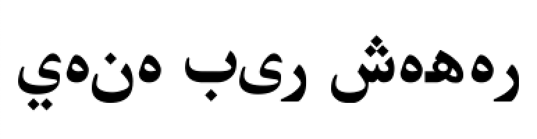
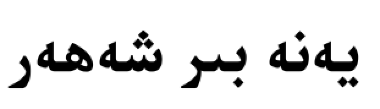

<div dir="rtl">

# ئۇيغۇرچە خەتنى رەسىم ھالىتىدە ئىشلىتىش قورالى

**ئۇيغۇرچە خەت ئۇلاشماسلىق مەسىلىسى ھەل قىلىندى ، قوشۇمچە ULY ئالماشتۇرۇش ئىقتىدارى قوشۇلدى .**

### قورال ئىشلىتىشتىن بۇرۇن


---

### قورال ئىشلەتكەندە


---

### خەت ئۇلاشماسلىق مەسىلىسىنىڭ سىناق كودى 
</div>

```python
from PIL import Image, ImageDraw, ImageFont
from UyghurLanguageUtils import UyghurCharUtilities

text = 'يەنە بىر شەھەر'

text_to_be_reshaped = UyghurCharUtilities()
reshaped_text = text_to_be_reshaped.getUyPFStr(text, reverse=True)

font = ImageFont.truetype('./UKIJTuT.ttf', 55)

image = Image.new('RGBA', (800, 600), ('#fff'))
image_draw = ImageDraw.Draw(image)
image_draw.text((10,10), reshaped_text, fill=('#000'), font=font)

image.show()
```

<div dir="rtl">

### ULY ئالماشتۇرۇش سىناق كودى 

</div>

```python
>>> from UyghurLanguageUtils import UyghurCharUtilities
>>> text = UyghurCharUtilities()
>>> text.getUyULYStr('يەنە بىر شەھەر')
'yene bir sheher'
```


<div dir="rtl">

### پايدىلانغان ماتىرياللار

- [xirwajim/UyghurCharUtilities](https://github.com/xirwajim/UyghurCharUtilities)
- [mpcabd/python-arabic-reshaper](https://github.com/mpcabd/python-arabic-reshaper)


### تولۇقلىما

</div>

```python
image_draw.text((10,10), 'يەنە بىر شەھەر', fill=('#000'), font=font, align='right', direction='rtl')
```

<div dir="rtl">
يۇقارقى كودىتىكىدەك پارامىتىر direction ئارقىلىقمۇ خەت ئۇلاشماسلىق مەسىلىسىنى ھەل قىلغىنى بولىدۇ !
</div>